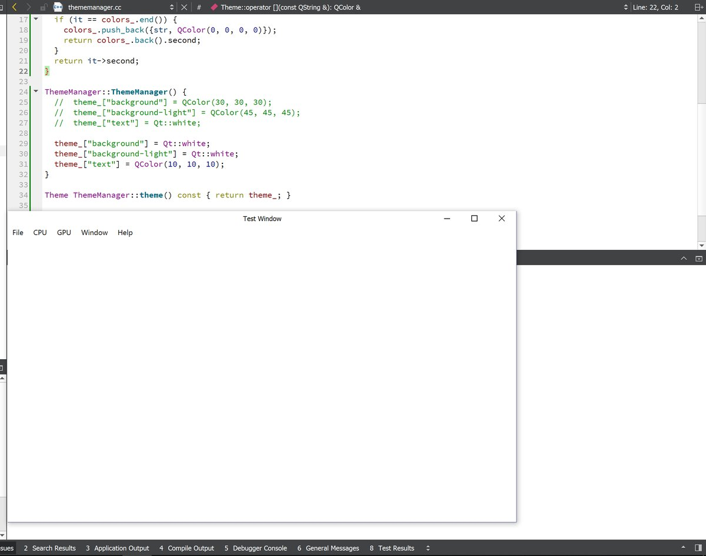

My fork of TrueFramelessWindow that is adapted to closer represent the windows 10 desktop UI style

It is currently a WIP, the window buttons are functional but do not have any animations on hover for example. There is also not yet a "maximized" icon svg, if you happen to have one please let me know.

---
# TrueFramelessWindow
A true frameless window with Qt, on both Windows and macOS

## Why
I’m picky about how my apps look, so I want to control the entire application area. Windows and macOS both draw title bar chrome on their windows that aren’t easily controllable from an application. Removing this chrome is surprisingly frustrating. Qt has a “Qt::FramelessWindowHint” attribute that draws a frameless window as described, but it comes at the cost of Min/Max/Close, resize, and on Windows, Aero Snap functionality. You can reimplement Min/Max/Close/Resizing yourself, but I find it super annoying not having Aero Snap.

There exist drop-in projects for Windows like BorderlessWindow & lib sleek that aim to address this, but they a require min 1px border (yuck) to reveal the native window underneath your Qt widget for resizing support. They also ship with their own title bar implementation including Min/Max/Close buttons, which takes away from my goal of having full control of a true borderless/frameless window. The last deal breaker for me was that these projects don’t support Hi-DPI — if you set Qt::AA_EnableHighDpiScaling, their drawing logic ends up off by whatever the devicePixelRatio factor is (usually two). And then of course, I still need to implement macOS support.

Anyway.

If you’re looking for a true frameless window that can still be resized & Aero Snap’d on Windows, check out TrueFramelessWindow. It has both Windows and macOS support, and I did my best to comment every piece clearly.

## How
The short version of how its done: macOS proves easiest, you just need a bit of Obj-c code to hide the titlebar. On Windows, the trick is capturing native window messages in both QWinWidget (a bridge widget) and a parent native Windows window. With some clever use of HTTRANSPARENT to pass events to the parent native Windows window for resizing & dragging, plus passing close events the other way to the QWinWidget child window for handling within Qt there, you successfully own the entire window area and have Min/Max/Close/resize/aero snap.

## History
Merged pull request from [@alexandernst](https://github.com/alexandernst/) simplifying the setGeometry approach between Windows and macOS/Linux. Thank you Alexander!
